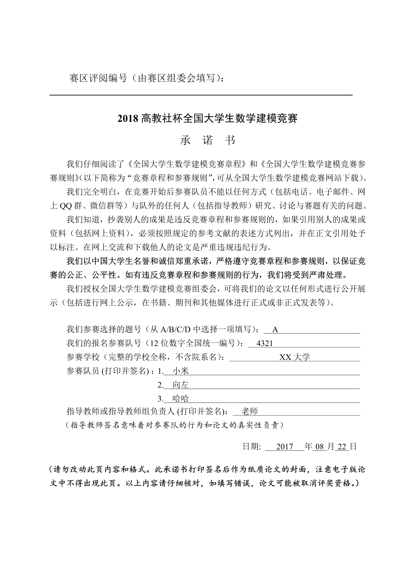
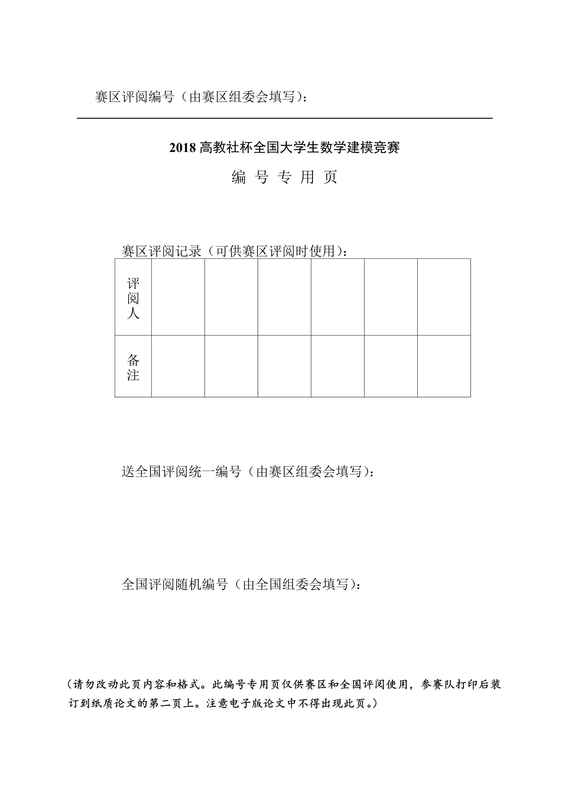
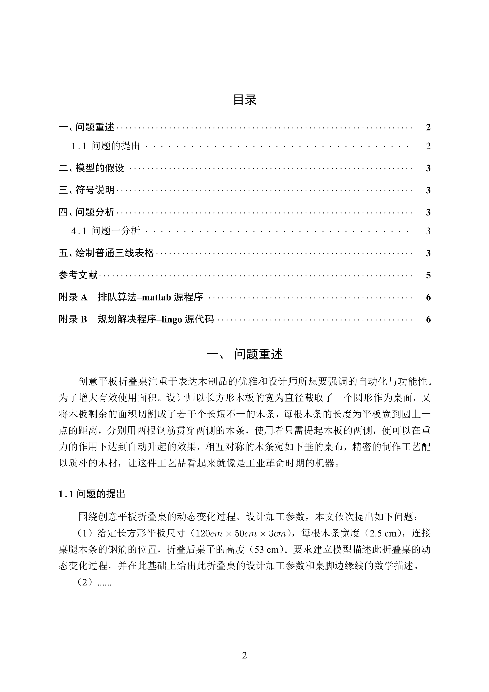

## 全国大学生数学建模竞赛LaTeX论文模板

cumcmthesis 是[LaTeX 工作室](https://www.latexstudio.net/)为全国大学生数学建模竞赛编写的LaTeX模板, 旨在让大家仅专注于论文的内容写作, 而不用花费过多精力在格式的定制和调整上。

本手册是相应的参考, 其中提供了一些环境和命令可以让模板的使用更为方便。同时需要注意, 使用者需要有一定的 LaTeX 的使用经验, 至少要会使用 ctex 宏包的一些功能, 比如调节字距或修改字体大小等等。

钱院学辅的高旭帆同学制作的示例，详情请参看 [example.pdf](https://github.com/qyxf/mcm-cumcm-thesis/raw/master/example.pdf)

如果需要去掉封面并把论文标题保留在摘要上面，在加载类的使用如下语句：

    \documentclass[withoutpreface,bwprint]{cumcmthesis}

如果需要封面页，则是与原来一致：

    \documentclass[bwprint]{cumcmthesis}
